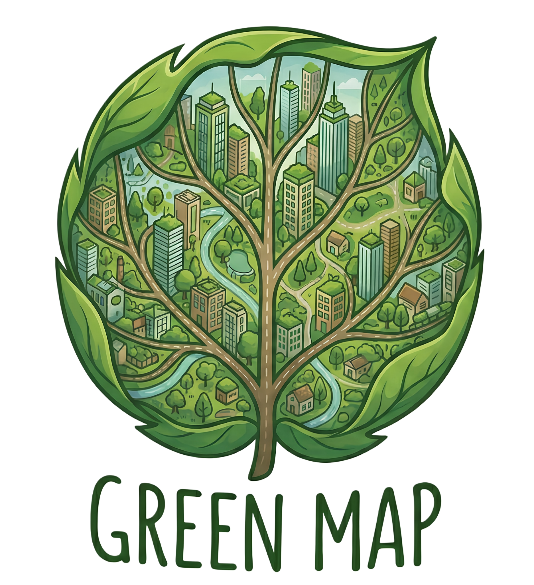
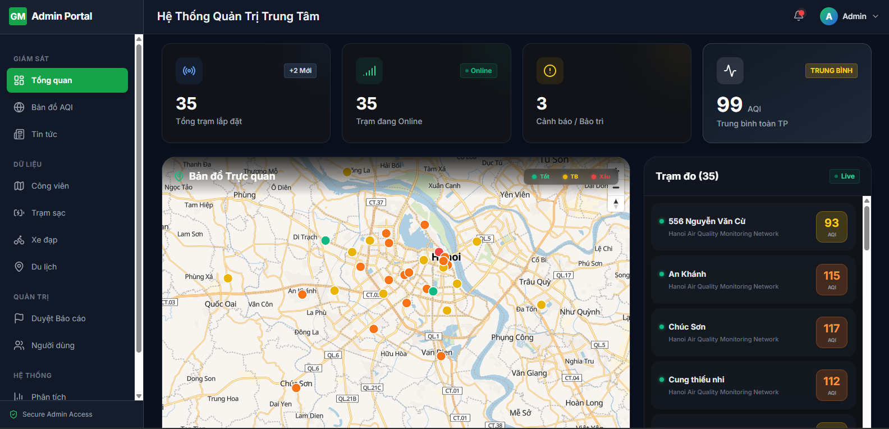
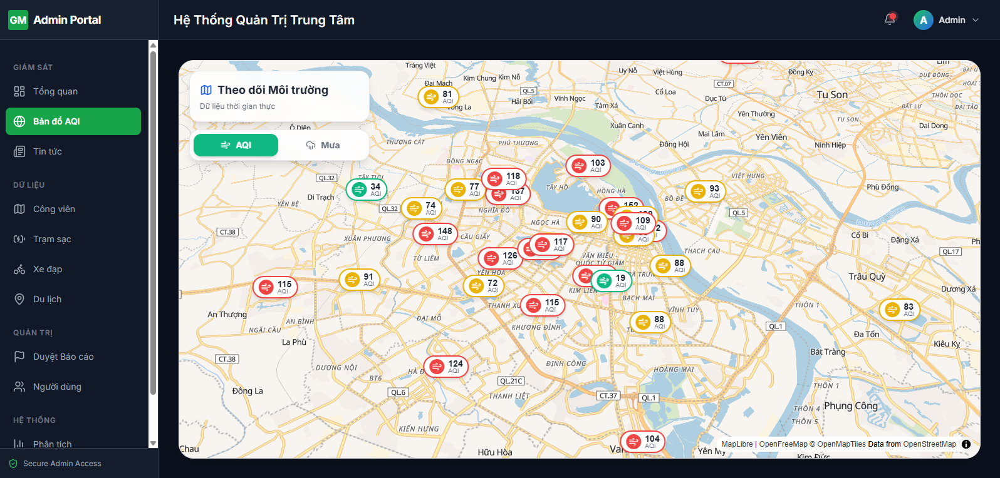
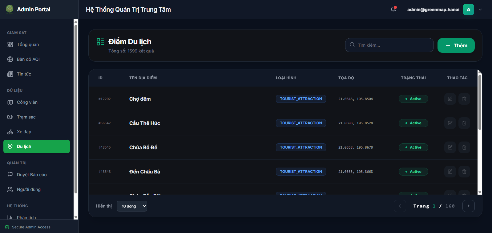

<div align="center">
  <a href="https://github.com/HouHackathon-CQP/GreenMap-Frontend">
    
  </a>

  <h1 style="font-size: 3rem; font-weight: 800; margin-top: 20px;">Green Map Admin Portal 🌿</h1>

  <p style="font-size: 1.2rem; color: #888; max-width: 600px; margin: 0 auto;">
    Hệ thống Quản trị & Giám sát Môi trường Đô thị Thông minh. <br>
    Nơi công nghệ gặp gỡ thiên nhiên vì một Hà Nội xanh hơn.
  </p>

  <br>

  <p align="center">
    <a href="#tinh-nang">✨ Tính năng</a> •
    <a href="#cong-nghe">🛠 Công nghệ</a> •
    <a href="#cai-dat">🚀 Cài đặt</a> •
    <a href="#thanh-vien">👥 Đội ngũ</a> •
    <a href="#dong-gop">🤝 Đóng góp</a>
  </p>

  <p align="center">
    
    
    
    
  </p>
</div>

---

## 📖 Giới thiệu

Chào mừng đến với **GreenMap Admin Portal**! 👋

Đây là "bộ não" trung tâm của dự án Bản Đồ Xanh. Dự án được xây dựng với mục tiêu cung cấp cho các nhà quản lý đô thị một cái nhìn toàn cảnh, trực quan và thời gian thực (Real-time) về sức khỏe môi trường của thành phố Hà Nội.

Hệ thống tích hợp dữ liệu từ các cảm biến IoT, báo cáo từ cộng đồng và API thời tiết chuẩn xác để đưa ra các cảnh báo sớm và hỗ trợ ra quyết định quy hoạch đô thị.

<h2 id="layout">🎨 Giao diện dự án</h2>

<p align="center">
    
    
    
</p>

## ✨ Tính năng Thực tế <a id="tinh-nang"></a>

Hệ thống quản trị hoàn chình với các tính năng chuyên sâu:

### 1. Dashboard Tổng quan 📊
Trung tâm điều khiển chính của hệ thống:
* **KPIs Thời gian thực:** Hiển thị tổng số trạm (120+), trạm Online/Offline, cảnh báo bảo trì và chỉ số AQI trung bình toàn thành phố với mã màu chuẩn.
* **Bản đồ 3D Tương tác:** Bản đồ nghiêng (Pitch view) hiển thị vị trí các trạm quan trắc với GPS positioning chính xác.
* **Widget Thời tiết:** Hiển thị nhiệt độ, độ ẩm hiện tại và **biểu đồ dự báo 24h** với biểu đồ Area Chart kết hợp nhiệt độ & xác suất mưa.
* **Phân tích Ô nhiễm:** Biểu đồ cột (Bar Chart) xếp hạng AQI theo Quận/Huyện giúp phát hiện điểm nóng ô nhiễm.
* **Bộ lọc AQI:** Toggle button để lọc chỉ hiển thị 5 trạm quan trọng (whitelist system).

### 2. Bản đồ Giám sát Đa lớp 🗺️
Công cụ phân tích không gian đa chiều:
* **7 Chế độ xem:** Chuyển đổi linh hoạt giữa các lớp dữ liệu:
    * 💨 **AQI:** Chất lượng không khí với mã màu tiêu chuẩn Vietnam QCVN 05:2013 (5 mức độ)
    * 🌧️ **RAIN:** Trạm thời tiết + dự báo 24h cho từng vị trí khi click
    * 🚗 **TRAFFIC:** Lớp phủ mật độ giao thông theo thời gian
    * 🌳 **PUBLIC_PARK:** Công viên công cộng
    * ⚡ **CHARGING_STATION:** Trạm sạc xe điện
    * 🚴 **BICYCLE_RENTAL:** Điểm thuê xe đạp
    * 📸 **TOURIST_ATTRACTION:** Điểm tham quan du lịch
* **Tính năng nâng cao:** GPS định vị, bán kính lọc (1km-10km), Sidebar chi tiết với thông tin kỹ thuật.

### 3. Quản lý Báo cáo Cộng đồng 📢
Hệ thống kiểm duyệt báo cáo từ người dân:
* **3 Tab trạng thái:** `PENDING` (Chờ xử lý), `APPROVED` (Đã duyệt), `REJECTED` (Đã từ chối).
* **Thông tin đầy đủ:** Tiêu đề, mô tả, tọa độ GPS, ảnh hiện trường, timestamp, ID báo cáo.
* **Xử lý 1-click:** Nút Duyệt (màu xanh) / Từ chối (màu xám) với hiệu ứng active.
* **Công cụ Test:** Nút "Tạo Test" để tạo báo cáo mẫu với ảnh ngẫu nhiên.

### 4. Quản lý Hạ tầng Xanh 🌳
System CRUD cho 4 loại hạ tầng:
* **Công viên** (`/parks`): Quản lý công viên công cộng
* **Trạm sạc** (`/charging`): Trạm sạc xe điện  
* **Thuê xe đạp** (`/bikes`): Điểm thuê xe đạp
* **Du lịch** (`/tourist`): Điểm tham quan du lịch
* **Tính năng:** Thêm/Sửa/Xóa với modal xác nhận, phân trang, tìm kiếm theo tên.

### 5. Quản lý Người dùng 👥
Hệ thống user management:
* **Vai trò:** Phân biệt ADMIN và CITIZEN với badge màu sắc khác nhau.
* **Trạng thái:** Toggle Hoạt động/Đã khóa với switch button.
* **Thông tin:** Tên, email, vai trò, thời gian tạo, trạng thái hoạt động.

### 6. Analytics & Báo cáo 📈
Dashboard phân tích chuyên sâu:
* **Biểu đồ so sánh:** AQI thực tế vs dự báo theo timeline.
* **Lịch sử báo cáo:** Danh sách các báo cáo đã tạo với trạng thái và dung lượng.
* **Export PDF:** Tải xuống báo cáo định dạng PDF.

---

## 🛠 Công nghệ Sử dụng <a id="cong-nghe"></a>

Dự án sử dụng những công nghệ Frontend mới nhất để đảm bảo hiệu năng và trải nghiệm phát triển (DX):

| Thành phần | Công nghệ | Lý do lựa chọn |
| :--- | :--- | :--- |
| **Core** | [React 18](https://react.dev/) + [Vite](https://vitejs.dev/) | Tốc độ khởi động và HMR siêu nhanh. |
| **Styling** | [Tailwind CSS](https://tailwindcss.com/) | Xây dựng giao diện nhanh chóng, chuẩn Design System. |
| **Maps** | [MapLibre GL JS](https://maplibre.org/) | Render bản đồ Vector mượt mà, hỗ trợ 3D. |
| **Charts** | [Recharts](https://recharts.org/) | Vẽ biểu đồ đẹp, responsive và dễ tùy biến. |
| **Icons** | [Lucide React](https://lucide.dev/) | Bộ icon hiện đại, nhẹ và đồng bộ. |
| **API Client** | Fetch API + Custom Service | Xử lý Token tự động, Caching dữ liệu thông minh để giảm tải Server. |

---

## 📁 Cấu trúc Dự án

```
src/
├── components/          # Các component tái sử dụng
│   ├── GreenMap.jsx           # Component bản đồ tích hợp MapLibre GL
│   ├── Header.jsx             # Header thanh điều hướng
│   ├── Sidebar.jsx            # Sidebar quản lý điều hướng
│   ├── WeatherWidget.jsx      # Widget dự báo thời tiết 24h
│   └── ...
├── pages/              # Các trang chính
│   ├── Dashboard.jsx          # Dashboard tổng quan (KPIs, Charts, Map)
│   ├── AirQualityMap.jsx      # Bản đồ giám sát đa lớp (AQI, Thời tiết, Giao thông)
│   ├── Analytics.jsx          # Trang phân tích chi tiết
│   ├── ReportApproval.jsx     # Quản lý duyệt báo cáo cộng đồng
│   ├── ContentManagement.jsx  # Quản lý hạ tầng (Công viên, Trạm sạc, etc.)
│   ├── UserManagement.jsx     # Quản lý người dùng
│   ├── Settings.jsx           # Cài đặt tài khoản & bảo mật
│   ├── Login.jsx              # Trang đăng nhập
│   ├── NewsFeed.jsx           # Tin tức môi trường
│   └── Landing.jsx            # Trang chủ giới thiệu
├── services/           # API Client & Business Logic
│   ├── apiClient.js           # Cấu hình Fetch API với JWT Token Auto-inject
│   ├── aqiService.js          # Service lấy dữ liệu AQI
│   ├── authService.js         # Service xác thực (Login/Logout)
│   ├── weatherService.js      # Service dữ liệu thời tiết & dự báo 24h
│   ├── trafficService.js      # Service giao thông (5min cache)
│   ├── reportService.js       # Service báo cáo cộng đồng
│   ├── newsService.js         # Service tin tức
│   ├── userService.js         # Service quản lý người dùng
│   ├── contentService.js      # Service nội dung (Công viên, Trạm sạc)
│   └── index.js               # Export tất cả services
├── context/            # React Context cho state global
│   ├── ThemeContext.jsx       # Quản lý theme (Light/Dark mode)
│   └── ...
├── utils/              # Các hàm tiện ích
│   ├── aqiCalculator.js       # Tính toán AQI theo chuẩn Vietnam QCVN 05:2013
│   ├── aqi-color.config.js    # Cấu hình mã màu AQI
│   └── ...
├── assets/             # Hình ảnh, font, assets tĩnh
│   └── ...
├── App.jsx             # Component root
├── App.css             # CSS global
├── index.css           # CSS reset & Tailwind imports
└── main.jsx            # Entry point
```

### 📝 Mô tả chi tiết các thư mục:

| Thư mục | Tác dụng |
| :--- | :--- |
| **components/** | Chứa các component React tái sử dụng (GreenMap, Header, Weather Widget, etc.) |
| **pages/** | Các trang chính của ứng dụng, mỗi file ứng với một route |
| **services/** | Lớp giao tiếp với Backend API, xử lý dữ liệu và caching |
| **context/** | Global state management bằng React Context (Theme, Auth, etc.) |
| **utils/** | Các hàm tiện ích, tính toán (AQI, màu sắc, format dữ liệu) |
| **assets/** | Tài nguyên tĩnh: hình ảnh, font, icon |

### 🔑 Các file quan trọng:

- **apiClient.js:** Quản lý Fetch API, tự động inject JWT Token vào headers, xử lý lỗi 401/403
- **aqiCalculator.js:** Tính toán chỉ số AQI theo tiêu chuẩn Vietnam QCVN 05:2013/BYT (5 mức độ)
- **AirQualityMap.jsx:** Bản đồ chính, hỗ trợ lọc dữ liệu, 3D view, GPS, 7 lớp dữ liệu
- **Dashboard.jsx:** KPIs, biểu đồ phân tích, widget thời tiết, danh sách trạm

---

## 🚀 Hướng dẫn Cài đặt & Chạy <a id="cai-dat"></a>

Hãy đảm bảo máy bạn đã cài đặt [Node.js](https://nodejs.org/) (v18 trở lên) và [Git](https://git-scm.com/).

### 1. Tải mã nguồn
Mở terminal và chạy lệnh sau để kéo dự án về máy:

```bash
git clone https://github.com/HouHackathon-CQP/GreenMap-Frontend.git
```

<h3>2. Cài đặt thư viện</h3>

Di chuyển vào thư mục dự án và cài đặt các gói phụ thuộc

```bash
cd GreenMap-Frontend
npm install
```

<h3>3. Cấu hình môi trường (.env)</h3>

Tạo một file `.env` tại thư mục gốc của dự án (ngang hàng với package.json) và thêm địa chỉ API Backend của bạn:

```bash
VITE_API_BASE_URL=(link API từ backend)
```

<h3>4. Khởi chạy</h3>
Chạy lệnh sau để bắt đầu dự án:

```bash
npm run dev
```

truy cập đường dẫn ở terminal để xem kết quả! 🎉

<h2 id="thanh-vien">🤝 Thành viên dự án</h2>

<table>
  <tr>
    <td align="center">
      <a href="#">
        <br>
        <sub>
          <b>Trần Anh Quân</b>
        </sub>
      </a>
    </td>
    <td align="center">
      <a href="#">
        <br>
        <sub>
          <b>Trần Trọng Chiến</b>
        </sub>
      </a>
    </td>
    <td align="center">
      <a href="#">
        <br>
        <sub>
          <b>Nguyễn Hà Phương</b>
        </sub>
      </a>
    </td>
  </tr>
</table>

<h2 id="dong-gop">📫 Cách đóng góp</h2>

Chúng tôi rất hoan nghênh mọi sự đóng góp từ cộng đồng để dự án hoàn thiện hơn. Quy trình đóng góp như sau:

1. <a href="https://github.com/HouHackathon-CQP/GreenMap-Frontend/fork">**Fork**</a> dự án này về tài khoản của bạn.
2. Tạo một nhánh mới (**Branch**) cho tính năng bạn muốn làm: ``git checkout -b feature/Ten-Tinh-Nang``
3. **Commit** các thay đổi của bạn: ``git commit -m 'Thêm tính năng ABC XYZ'``
4. **Push** nhánh đó lên GitHub của bạn: ``git push origin feature/Ten-Tinh-Nang``
5. Tạo một **Pull Request** về repo gốc. Mô tả rõ những thay đổi bạn đã thực hiện.

<h3>Tài liệu tham khảo thêm</h3>

[📝 Cách tạo Pull Request chuẩn](https://www.atlassian.com/br/git/tutorials/making-a-pull-request)

[💾 Quy tắc đặt tên Commit](https://gist.github.com/joshbuchea/6f47e86d2510bce28f8e7f42ae84c716)